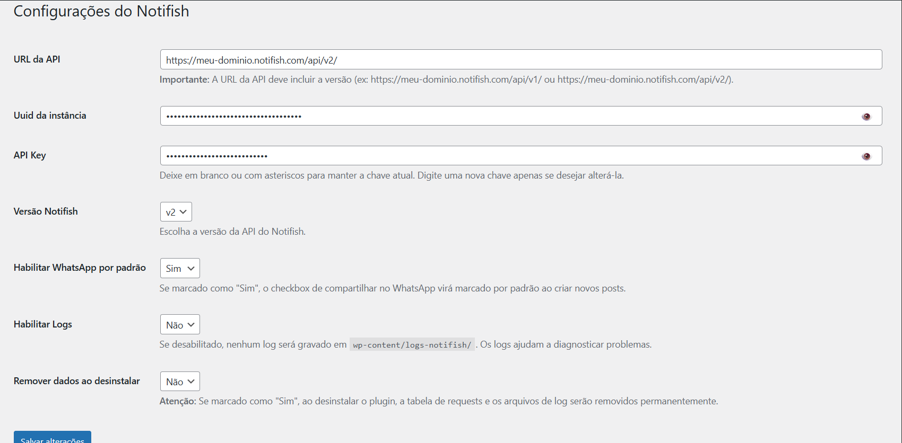
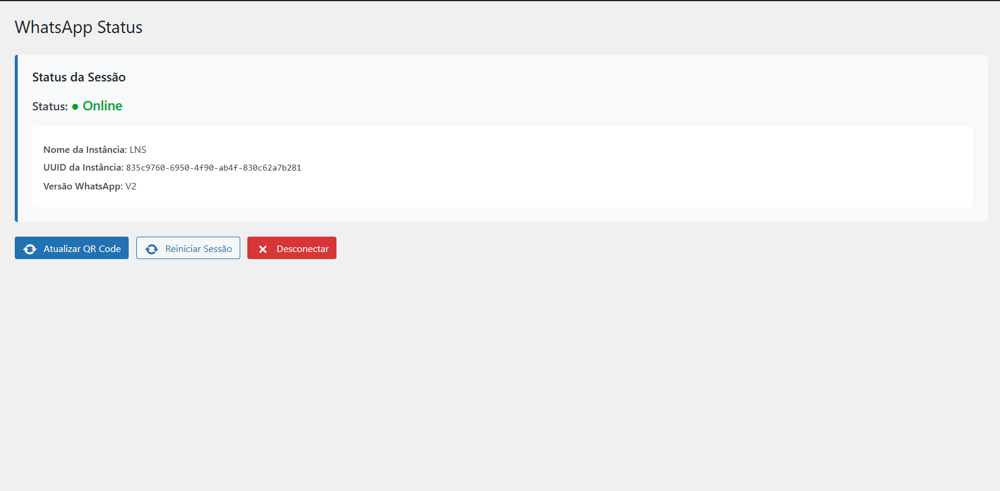

# Notifish WordPress Plugin

Plugin para gerenciar notificações via API do Notifish.

<p align="center">
  
</p>

## 📲 Como Funciona

O plugin Notifish permite enviar automaticamente notificações via WhatsApp quando você publica um post no WordPress. Ele se integra com a API do Notifish para enviar mensagens para grupos do WhatsApp.

## 📸 Screenshots

| Página de Configurações | Status do WhatsApp (API v2) |
|:-----------------------:|:---------------------------:|
|  |  |
| Configure API URL, UUID e API Key | QR Code e status da sessão |

## ✨ Funcionalidades Principais

1. **Envio Automático de Notificações**
   - Quando você publica um post e marca a opção "Compartilhar no WhatsApp", o plugin envia automaticamente uma mensagem para os grupos configurados
   - A mensagem inclui o título do post (em negrito) e o link do post com parâmetro UTM (`?utm_source=whatsapp`)
   - O plugin verifica se o post já foi enviado anteriormente para evitar envios duplicados

2. **Meta Box no Editor de Posts**
   - Um checkbox aparece no editor de posts permitindo habilitar/desabilitar o envio para cada post
   - Você pode configurar se o checkbox vem marcado por padrão nas configurações
   - Se o post já foi enviado, uma mensagem vermelha aparece informando que a matéria já foi compartilhada

3. **Suporte a Posts Agendados**
   - Posts agendados disparam a mensagem automaticamente quando são publicados pelo WP-Cron
   - Funciona tanto para posts agendados pelo desktop quanto pelo app do WordPress
   - O valor padrão das configurações é aplicado automaticamente

4. **Compatibilidade com App WordPress (iOS/Android)**
   - O plugin funciona com posts criados pelo app oficial do WordPress
   - Suporte completo à REST API do WordPress
   - O campo de habilitação do WhatsApp está disponível via REST API
   - Posts criados pelo app usam o valor padrão das configurações (checkbox habilitado por padrão)

5. **Histórico de Envios (Logs)**
   - Todas as tentativas de envio são registradas em uma tabela no banco de dados
   - Você pode visualizar os últimos 20 envios no menu "Notifish Logs"
   - Cada registro mostra: ID do post, título, status HTTP, resposta da API, data/hora e usuário que publicou
   - É possível reenviar mensagens diretamente da lista de logs

6. **Status do WhatsApp (API v2)**
   - Quando configurado para usar a API v2, o plugin oferece uma página de status do WhatsApp
   - Exibe o QR Code para conectar a sessão do WhatsApp
   - Mostra o status da conexão (Online/Aguardando QR Code)
   - Permite reiniciar ou desconectar a sessão do WhatsApp

7. **Sistema de Logs Detalhado**
   - Logs detalhados são salvos em `wp-content/logs-notifish/`
   - Você pode habilitar/desabilitar os logs nas configurações
   - Os logs ajudam a diagnosticar problemas de comunicação com a API

## 🔄 Fluxo de Funcionamento

1. **Configuração Inicial**
   - Acesse o menu "Notifish" no WordPress
   - Configure a URL da API (deve incluir a versão: `/api/v1/` ou `/api/v2/`)
   - Informe o UUID da instância e a API Key
   - Escolha a versão da API (v1 ou v2)
   - **Importante:** Habilite "WhatsApp por padrão" para que posts do app sejam enviados automaticamente
   - Salve as configurações

2. **Publicação de Post (Desktop)**
   - Ao criar/editar um post, marque o checkbox "Deseja compartilhar no WhatsApp?"
   - Publique o post
   - O plugin verifica se o checkbox está marcado e se o post já foi enviado
   - Se tudo estiver OK, dispara o envio via API

3. **Publicação de Post (App WordPress iOS/Android)**
   - Crie e publique o post normalmente pelo app
   - O plugin aplica automaticamente o valor padrão das configurações
   - Se "WhatsApp por padrão" estiver habilitado, a mensagem é enviada automaticamente
   - Funciona tanto para publicação imediata quanto para posts agendados

4. **Posts Agendados**
   - Agende o post pelo desktop ou pelo app do WordPress
   - Quando chegar o horário agendado, o WP-Cron publica o post automaticamente
   - O plugin detecta a transição de status (`future` → `publish`) e dispara a mensagem
   - Logs detalhados registram todo o processo

5. **Processo de Envio**
   - O plugin coleta os dados do post (título, URL, ID)
   - Monta a mensagem no formato: `*Título do Post*\n\nURL do Post`
   - Faz uma requisição POST para a API do Notifish
   - Salva o resultado (sucesso ou erro) no banco de dados
   - Registra tudo nos logs (se habilitado)

6. **Reenvio de Mensagens**
   - Acesse "Notifish Logs" no menu
   - Localize a mensagem que deseja reenviar
   - Clique no botão "Reenviar"
   - O plugin reenvia a mensagem usando os mesmos dados do post original

## 📁 Estrutura do Plugin

O plugin é organizado em classes especializadas:

- **Notifish**: Classe principal que inicializa e coordena todos os componentes
- **Notifish_Admin**: Gerencia a interface administrativa e meta boxes
- **Notifish_API**: Responsável pela comunicação com a API do Notifish (suporta v1 e v2)
- **Notifish_Database**: Gerencia as operações no banco de dados (tabela de requests)
- **Notifish_Logger**: Sistema de logs detalhado
- **Notifish_Ajax**: Handlers AJAX para QR Code e status do WhatsApp (v2)

## 🪝 Hooks Utilizados

O plugin utiliza diversos hooks do WordPress para capturar publicações de posts:

| Hook | Descrição |
|------|-----------|
| `save_post` | Captura publicações via admin (editor clássico/Gutenberg) |
| `rest_after_insert_post` | Captura publicações via REST API (app WordPress) |
| `transition_post_status` | Captura transições de status (posts agendados, qualquer origem) |
| `xmlrpc_publish_post` | Captura publicações via XML-RPC (apps legados) |

## 🔌 REST API

O plugin expõe o campo `_notifish_meta_value_key` via REST API:

```
GET /wp-json/wp/v2/posts/{id}
```

Resposta inclui:
```json
{
  "meta": {
    "_notifish_meta_value_key": "1"
  }
}
```

Para criar um post com Notifish habilitado via API:
```
POST /wp-json/wp/v2/posts
{
  "title": "Meu Post",
  "status": "publish",
  "meta": {
    "_notifish_meta_value_key": "1"
  }
}
```

Valores possíveis:
- `"1"` = Enviar para WhatsApp
- `""` ou ausente = Usa valor padrão das configurações

## ⚡ Diferenças entre API v1 e v2

**API v1:**
- Envia mensagens com parâmetros: `link`, `typing`, `delay`
- Não possui gerenciamento de sessão do WhatsApp

**API v2:**
- Envia mensagens com parâmetro: `linkPreview`, `delay`
- Possui página de status do WhatsApp
- Permite visualizar QR Code, status da conexão, reiniciar e desconectar sessão
- Suporta preview de links automaticamente

## 🗄️ Banco de Dados

O plugin cria uma tabela `wp_notifish_requests` que armazena:
- ID do request
- ID e título do post
- Número de telefone/grupo
- Código de status HTTP
- Resposta da API
- ID e nome do usuário que publicou
- Data/hora do envio

## ⚙️ Configurações Disponíveis

- **URL da API**: Endpoint da API do Notifish (deve incluir `/api/v1/` ou `/api/v2/`)
- **UUID da Instância**: Identificador único da sua instância
- **API Key**: Chave de autenticação (pode ser alterada sem perder a anterior se deixar em branco)
- **Versão Notifish**: Escolha entre v1 ou v2
- **Habilitar WhatsApp por padrão**: Se marcado, o checkbox vem marcado automaticamente em novos posts
- **Habilitar Logs**: Ativa/desativa o sistema de logs detalhado
- **Remover dados ao desinstalar**: Se marcado, remove tabela e logs ao desinstalar o plugin

## 🔒 Segurança

Este plugin implementa várias medidas de segurança para prevenir ataques:

### 🛡️ Proteção contra Acesso Direto
- ✅ Verificação de `ABSPATH` em todos os arquivos PHP
- ✅ Arquivos `index.php` vazios em todas as pastas para prevenir listagem de diretórios
- ✅ Arquivo `.htaccess` para bloquear acesso direto a arquivos sensíveis
- ✅ Verificação de `WP_UNINSTALL_PLUGIN` no arquivo de desinstalação

### 🚫 Proteção contra Ataques
- ✅ **XSS (Cross-Site Scripting)**: Todas as saídas usam `esc_html()`, `esc_attr()`, `esc_js()`, `esc_url()`
- ✅ **SQL Injection**: Todas as consultas usam `$wpdb->prepare()` com placeholders
- ✅ **CSRF (Cross-Site Request Forgery)**: Nonces em todos os formulários e requisições AJAX
- ✅ **Sanitização de Entrada**: `sanitize_text_field()`, `esc_url_raw()`, `absint()` em todos os dados de entrada
- ✅ **Validação de Permissões**: `current_user_can('manage_options')` em todas as páginas admin
- ✅ **Validação de Nonce**: `wp_verify_nonce()` em todas as requisições AJAX e formulários

### 📂 Estrutura de Segurança
```
notifish/
├── notifish.php          # Arquivo principal (protegido)
├── uninstall.php         # Script de desinstalação (protegido)
├── .htaccess            # Proteção de acesso
├── .gitignore           # Arquivos ignorados pelo Git
├── README.md            # Documentação
├── includes/            # Classes principais (protegidas)
│   └── index.php        # Arquivo vazio de proteção
├── admin/               # Interface administrativa (protegida)
│   ├── index.php        # Arquivo vazio de proteção
│   └── views/           # Views admin (protegidas)
│       └── index.php     # Arquivo vazio de proteção
└── assets/              # CSS e JS (protegidos)
    ├── index.php        # Arquivo vazio de proteção
    ├── css/
    │   └── index.php    # Arquivo vazio de proteção
    └── js/
        └── index.php    # Arquivo vazio de proteção
```

## 📄 Licença

GPL v2 or later

---

<p align="center">
  Desenvolvido com ❤️ por <a href="https://notifish.com">Notifish</a>
</p>
